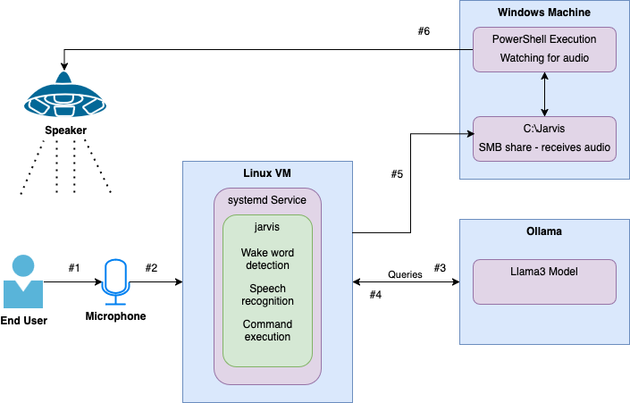

# Jarvis Voice Assistant


Jarvis is a voice-activated assistant powered by local models including Whisper (speech-to-text), LLaMA (language model), and Coqui TTS (text-to-speech). It supports real-time wake word detection via Porcupine and understands both static commands and open-ended natural language.

---

## Architecture


## Features

- **Passive Wake Word Detection** (via Picovoice Porcupine)
- **Speech-to-Text** using OpenAI Whisper
- **Command Recognition** (predefined commands with shell actions)
- **Natural Language Understanding** using LLaMA 3 via Ollama
- **Contextual Memory** for ongoing conversations
- **Text-to-Speech** via Coqui TTS
- **Audio Playback Coordination** with Windows via shared locks
- **Systemd Compatibility** for long-running background use
- **Modular Architecture** with clean separation of concerns

---

## Project Structure
```
jarvis_project/
├── jarvis/
│ ├── audio/
│ │ ├── recorder.py # Audio recording
│ │ └── tts.py # Text-to-speech
│ ├── core/
│ │ ├── context.py # Maintains recent conversation turns
│ │ ├── executor.py # Main command routing
│ │ ├── llm.py # LLaMA interaction via Ollama
│ │ ├── static_commands.py # Shell-bound voice commands
│ │ └── wakeword.py # Wake word listening
│ ├── utils/
│ │ └── text_cleaner.py # Cleanup markdown & formatting
│ ├── assets/
│ │ └── jarvis_linux.ppn # Wake word file for Porcupine
│ ├── config.py # All paths and constants
│ └── main.py # Entrypoint logic
├── run.py # Launcher script
├── requirements.txt
├── .env # Secrets like access_key
└── README.md
```

## Requirements
- Python 3.10+
- A Linux machine with microphone support (PulseAudio or ALSA)
- [Ollama](https://ollama.com/) with `llama3` or similar model running
- Wake word file from [Picovoice Console](https://console.picovoice.ai/)
- Optional: Shared folder and lock file for coordinated playback with Windows

---

## Setup

### 1. Clone and Activate

```bash
git clone https://github.com/YOUR_USERNAME/jarvis_project.git
cd jarvis_project
python3 -m venv venv
source venv/bin/activate
pip install -r requirements.txt
```
### 2. Configure Environment

Create a .env file with your Porcupine access key:
```
ACCESS_KEY=your_porcupine_key_here
```

### 3. Run Jarvis
```
python run.py
```

## Commands
|Voice Command|Action|
|---|---|
|Open browser|Launches default browser|
|Say hello|Responds politely|
|List files|Runs ls -l in shell|
|Show disk space|Shows disk usage via df|
|Shutdown|(Pretend) shutdown message|
|`<Ask>`|Open-ended prompts are simply answered by LLaMA3|

## systemd Support
```
[Unit]
Description=Jarvis Voice Assistant
After=network.target sound.target

[Service]
User=your_username
WorkingDirectory=/opt/jarvis_project
ExecStart=/opt/jarvis_project/bin/python3 /opt/jarvis_project/run.py
Restart=always
RestartSec=5
Environment=PYTHONUNBUFFERED=1
StandardOutput=journal
StandardError=journal
# Give access to audio hardware
Environment="PULSE_SERVER=unix:/run/user/1000/pulse/native"
Environment="XDG_RUNTIME_DIR=/run/user/1000"
Group=audio

# Keep systemd from isolating device access
PrivateDevices=no

[Install]
WantedBy=multi-user.target
```
```
sudo systemctl daemon-reexec
sudo systemctl daemon-reload
sudo systemctl enable --now jarvis.service
```

## AI Context Memory
Jarvis maintains the last 10 turns of conversation to support contextual replies through LLaMA.

## Windows Scripting
**watch-and-play.ps1**
```
$watchPath = "C:\Jarvis"
$wavFile = "$watchPath\jarvis.wav"
$lockFile = "$watchPath\playback.lock"
$logFile = "$watchPath\playback_log.txt"

function Wait-For-File {
    param ($filePath, $timeoutSeconds = 10)
    $sw = [Diagnostics.Stopwatch]::StartNew()
    while ($sw.Elapsed.TotalSeconds -lt $timeoutSeconds) {
        if (Test-Path $filePath) {
            # File exists, check if stable
            $size1 = (Get-Item $filePath).length
            Start-Sleep -Milliseconds 500
            $size2 = (Get-Item $filePath).length
            if ($size1 -eq $size2) {
                return $true
            }
        }
        Start-Sleep -Milliseconds 250
    }
    return $false
}

Write-Output "Watching for Jarvis audio..."

while ($true) {
    if (Test-Path $lockFile) {
        Write-Output "Jarvis audio triggered at $(Get-Date)" | Tee-Object -FilePath $logFile -Append

        if (Wait-For-File -filePath $wavFile) {
            try {
                # Use PlaySync for blocking playback
                $player = New-Object System.Media.SoundPlayer $wavFile
                $player.PlaySync()
                Remove-Item $wavFile -ErrorAction Stop
                Remove-Item $lockFile -ErrorAction Stop
                Write-Output "Deleted: $wavFile and lock file" | Tee-Object -FilePath $logFile -Append
            }
            catch {
                Write-Output "Error during playback or deletion: $_" | Tee-Object -FilePath $logFile -Append
            }
        }
        else {
            Write-Output "WAV file not stable or never appeared." | Tee-Object -FilePath $logFile -Append
        }
    }

    Start-Sleep -Milliseconds 250
}
```

## Future Ideas
 - Migration off of Windows for playback and onto a centralized audio system.
   - Either MQTT Event + Media Receiver Clients, or a Custom REST or Socket Playback Microservice
 - Plugin architecture for custom extensions
 - Live web search using Google PSE + Ollama
 - MQTT or webhook support for smart home integration
 - Front-end web UI / GUI application for use on desktops and Android

## License
 - MIT — Use freely with attribution.

## Acknowledgments
 - [Picovoice Porcupine](https://picovoice.ai/)
 - [Ollama](https://ollama.com/)
 - [OpenAI Whisper](https://github.com/openai/whisper)
 - [Coqui TTS](https://github.com/coqui-ai/TTS)
